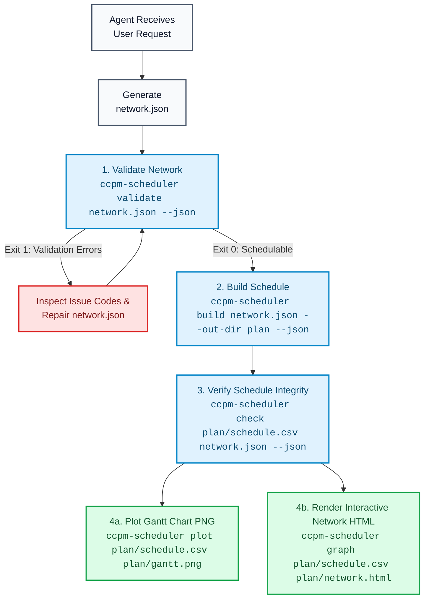

# AI Agent & Tool Integration

`ccpm-scheduler` was built from the ground up to serve as a deterministic scheduling engine for **AI Agents** (such as AI skills, Antigravity subagents, or autonomous coding assistants) as well as **GUI planning applications** (such as [our-planner](https://github.com/rnwolf/our-planner)).

---

## Agent-Friendly Design Principles

1. **Strict Exit Code Contract**:
   - `0`: Operation succeeded or inputs/schedules passed validation.
   - `1`: Domain/validation errors (e.g. circular dependency, unschedulable network). The structured JSON error report is still written to `stdout`.
   - `2`: Syntax or usage error.
   Agents can branch reliably on exit codes without parsing natural language prose.

2. **Machine-Discoverable Schemas**:
   Agents can inspect system contracts at runtime by calling:
   ```bash
   ccpm-scheduler schema network   # Input network shape
   ccpm-scheduler schema schedule  # Output schedule shape
   ccpm-scheduler schema report    # Validation report shape
   ```

3. **Machine-Readable JSON Mode (`--json`)**:
   Adding `--json` to `validate`, `build`, `check`, `plot`, or `graph` forces `ccpm-scheduler` to emit a single JSON document on `stdout`.

4. **Zero Interactivity & Determinism**:
   No interactive prompts, color codes, or non-deterministic heuristics. Identical inputs produce byte-identical schedules.

---

## AI Agent Workflow Integration

AI agents managing project schedules should follow this standard execution pipeline:



### Agent Skill Command Invocation Example

```bash
# Validate input
ccpm-scheduler validate project.json --json

# Build schedule and extract summary
ccpm-scheduler build project.json --out-dir plan --buffer-method cap --json
```

---

## GUI Tool Integration (e.g., `our-planner`)

For Python-based desktop or web applications, `ccpm-scheduler` can be imported directly as an in-process library without invoking shell subprocesses.

```python
from ccpm_scheduler import network_from_json, validate_network, build_schedule

# 1. Convert application task model into JSON network dictionary
network_dict = {
    "tasks": [...],
    "resources": [...],
    "buffer_method": "cap"
}

network = network_from_json(network_dict)

# 2. In-process validation
report = validate_network(network)
if not report.ok:
    # Highlight invalid tasks in GUI using report.errors
    display_validation_errors(report.errors)
else:
    # 3. In-process schedule build
    result = build_schedule(network, title=project_title)
    
    # 4. Import scheduled rows back into GUI workspace
    import_ccpm_rows(result.schedule.rows)
```

### Mapping Rules for GUI Integrations

- **Tasks**: Tasks in the GUI map to `Task` objects with `realistic_duration` and `optimal_duration`.
- **Buffers**: When importing `schedule.csv` rows back into a GUI, rows with `type == "project_buffer"` or `type == "feeding_buffer"` are imported as specialized buffer tasks attached via `PB` or `FB` links.
- **Resource Pools**: Resource names and capacity constraints are matched by `id` or `name`.
