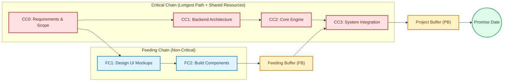

# Core Concepts & CCPM Theory

**Critical Chain Project Management (CCPM)** is a scheduling and project management methodology developed by Dr. Eliyahu M. Goldratt (introduced in his 1997 book *Critical Chain*). It applies the Theory of Constraints (TOC) to project environments.

Unlike traditional CPM (Critical Path Method) or PERT, which focus primarily on task dependencies, CCPM focuses on **resource dependencies** and **human behavior** to ensure predictable project delivery.

---

## Key Differences: CPM vs. CCPM

| Dimension | Critical Path Method (CPM) | Critical Chain Project Management (CCPM) |
|---|---|---|
| **Constraint** | Longest path of dependent tasks | Longest path of dependent tasks **and shared resources** (Critical Chain) |
| **Duration Estimates** | Padded ("realistic" or 80-90% confidence) estimates per task | Unpadded ("optimal" or 50% confidence) estimates per task |
| **Safety Buffers** | Hidden inside individual task durations | Stripped from tasks and aggregated into explicit **Project & Feeding Buffers** |
| **Task Execution** | Scheduled as early as possible (ASAP[^1] / ALAP mix), encouraging multitasking | Scheduled as late as possible (ALAP[^2]), with roadrunner execution (focus on one task at a time) |
| **Buffer Consumption** | Task delays directly consume hidden safety | Delays consume explicit buffers, monitored via buffer burn rate |

[^1]: **ASAP (As Soon As Possible)**: Traditional CPM scheduling defaults to starting tasks at their earliest possible start date, which often increases work-in-progress (WIP) and encourages multitasking.
[^2]: **ALAP (As Late As Possible)**: CCPM schedules tasks at their latest allowable start date without delaying milestone dates. This minimizes capital lockup, delays expenditure, and keeps resources focused on active critical tasks.

---

## 1. Two-Point Duration Estimates

Traditional project management estimates include safety padding so team members can meet their deadlines with high confidence. However, safety embedded in individual tasks is usually wasted due to:

- **Student Syndrome**: Delaying work until the last possible moment before the deadline.
- **Parkinson's Law**: Work expands to fill the time available for its completion.
- **Multitasking**: Switching between tasks causes context switches and lengthens total duration.

CCPM separates task estimates into two values:

- **Realistic Estimate (`realistic_duration`)**: Safe estimate with typical contingency (80–90% confidence).
- **Optimal Estimate (`optimal_duration`)**: Padding-free, aggressive duration estimate (50% confidence).

In `ccpm-scheduler`, if only a single estimate is provided, `optimal_duration` defaults to `ceil(realistic_duration / 2)`.

---

## 2. The Critical Chain & Resource Leveling

The **Critical Chain** is the sequence of resource-dependent and precedence-dependent tasks that determines the total project duration.

To identify the Critical Chain:
1. **Late-Start Scheduling**: Tasks are scheduled as late as possible without violating milestone dates.
2. **Resource Leveling**: Over-allocated resources (where daily demand exceeds resource capacity) are resolved deterministically by shifting tasks earlier or delaying dependent chains.

---

## 3. Buffer Protection

Safety stripped from individual tasks is placed into explicit buffers at key convergence points:

- **Project Buffer (PB)** *(Amber/Gold)*: Placed at the end of the Critical Chain to protect the committed promise date to stakeholders.
- **Feeding Buffer (FB)** *(Amber/Gold)*: Placed wherever a non-critical feeding chain merges into the Critical Chain, preventing delays on non-critical tasks from disrupting the Critical Chain.

### The Insurance Analogy: Pooled Protection vs. Local Optimization

Buffer protection in CCPM operates on the same economic principle as insurance:

- **Self-Insurance vs. Pooled Risk**: Individuals buy car and home insurance because holding personal cash reserves for every potential disaster is inefficient and expensive. By pooling risk across a population, a smaller central fund protects everyone far more effectively.
- **Pooled Project Buffers**: In traditional scheduling, every task owner adds a 20–50% safety cushion to their own estimate ("self-insuring"). This safety is routinely lost to Student Syndrome and Parkinson's Law. In CCPM, safety is stripped from individual tasks and pooled into central **Project** and **Feeding Buffers**, protecting the project far better with a shorter overall duration.

#### Aligning Incentives: Global Optimization over Local Optimization

A pooled insurance model only works if behavior and incentives are aligned to prevent moral hazard:

- **Global Optimization**: Team members execute tasks aggressively without padding ("roadrunner" approach) and hand off completed work immediately. Buffer consumption is tracked centrally as a project management signal, not used to grade individual task performance.
- **Avoiding Perverse Incentives**: If management penalizes team members for missing aggressive task estimates or rewards individuals for holding local contingency, teams will naturally revert to padding their own estimates (local optimization). Successful CCPM requires evaluating performance against **global project delivery**, ensuring buffers serve as collective protection rather than individual quotas.

#### Early Warning Signals: Rate of Buffer Consumption & Health Monitoring

The second critical power of pooled buffers is that they provide an objective, real-time control signal for project health:

- **Buffer Consumption as Telemetry**: In traditional project management, progress is often masked by subjective "90% complete" status updates. In CCPM, tracking the **rate of buffer consumption** relative to chain completion (such as via Green, Yellow, and Red zones on a Fever Chart) acts as real-time telemetry.
- **Proactive Management Interventions**: If the buffer burn rate outpaces completed work (moving into Yellow or Red zones), management receives an immediate, empirical signal to intervene—such as clearing bottlenecks or reallocating resources—weeks or months before the promise date is threatened.
- **Stakeholder Expectation Management**: By monitoring buffer consumption rates early, project managers can engage stakeholders with transparent data. This allows teams to negotiate scope adjustments or adjust promises proactively, eliminating late-stage surprises at the final deadline.

---

## 4. Deterministic Scheduling

`ccpm-scheduler` enforces strict determinism:
- Given identical tasks, resources, dependencies, and calendars, the scheduler produces **byte-identical** schedule tables and outputs every time.
- No random tie-breakers or non-deterministic heuristics are used.
- This makes schedules fully scriptable, diffable in git, and reliable for automated AI agent workflows.
