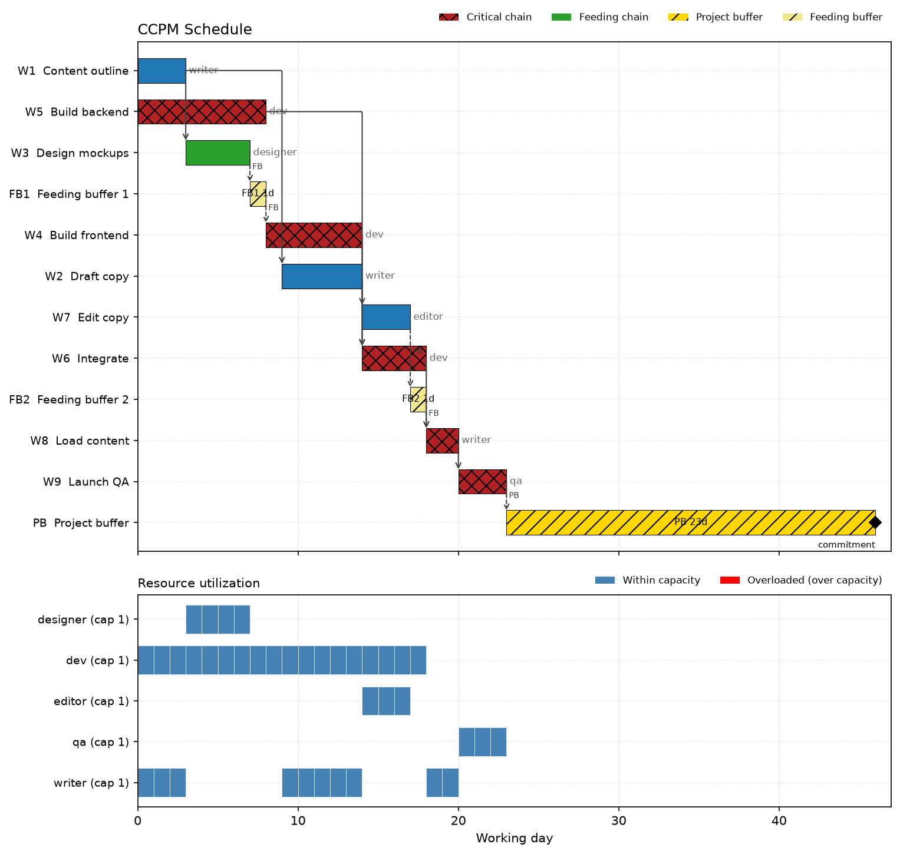

# Examples & CPM vs. CCPM Walkthrough

This guide provides a complete, step-by-step example comparing a traditional **Critical Path Method (CPM)** schedule against a **Critical Chain Project Management (CCPM)** schedule generated by `ccpm-scheduler`.

It demonstrates how `ccpm-scheduler` takes raw input networks, strips task-level safety padding, levels resource bottlenecks, inserts explicit project and feeding buffers, and compares the impact of the three buffer sizing methods (`cap`, `hchain`, and `rsem`).

---

## 1. Input Project Network

Consider a typical software release project ("Website Launch") with 8 tasks across 5 specialized roles (`writer`, `designer`, `dev`, `editor`, `qa`).

### `tasks.csv`
Task duration estimates contain standard 80-90% safe estimates (`realistic_duration`):

```csv
id,name,realistic_duration,predecessor_ids,resource_ids,url
W1,Content outline,6,,writer,https://example.com/tickets/W1
W2,Draft copy,10,W1,writer,https://example.com/tickets/W2
W3,Design mockups,8,W1,designer,https://example.com/tickets/W3
W4,Build frontend,12,W3,dev,https://example.com/tickets/W4
W5,Build backend,16,,dev,https://example.com/tickets/W5
W6,Integrate,8,W4;W5,dev,https://example.com/tickets/W6
W7,Edit copy,6,W2,editor,https://example.com/tickets/W7
W8,Load content,4,W6;W7,writer,https://example.com/tickets/W8
W9,Launch QA,6,W8,qa,https://example.com/tickets/W9
```

### `resources.csv`
Per-resource capacities (each role has a single person available):

```csv
id,name,capacity,url
writer,Content writer,1,https://example.com/teams/writer
designer,UI designer,1,https://example.com/teams/designer
dev,Developer,1,https://example.com/teams/dev
editor,Copy editor,1,https://example.com/teams/editor
qa,QA engineer,1,https://example.com/teams/qa
```

---

## 2. Traditional Critical Path (CPM) Schedule

In traditional Critical Path scheduling:

- **Padded Durations**: Tasks are scheduled using their full, padded `realistic_duration` estimates (totaling 46 working days along the primary path).
- **Hidden Safety**: Safety padding is hidden inside each task estimate. Because of Parkinson's Law ("work expands to fill the time allotted") and Student Syndrome ("procrastination until deadlines"), this safety is typically wasted.
- **Unprotected Merges**: Feeding chains (e.g., content drafting) merge directly into developer tasks without feeding buffer protection.

```mermaid
gantt
    title Traditional Critical Path (CPM) Schedule (Total: 46 Working Days)
    dateFormat X
    axisFormat %s
    section Primary Chain (Critical Path)
    W5 Build backend (16d)     :crit, w5, 0, 16d
    W4 Build frontend (12d)    :crit, w4, after w5, 12d
    W6 Integrate (8d)          :crit, w6, after w4, 8d
    W8 Load content (4d)       :crit, w8, after w6, 4d
    W9 Launch QA (6d)          :crit, w9, after w8, 6d
    section Non-Critical Paths
    W1 Content outline (6d)    :w1, 0, 6d
    W3 Design mockups (8d)     :w3, after w1, 8d
    W2 Draft copy (10d)        :w2, after w1, 10d
    W7 Edit copy (6d)          :w7, after w2, 6d
```



---

## 3. Critical Chain (CCPM) Schedule

When `ccpm-scheduler` processes this network:

- **Aggressive Durations**: Task durations are cut to 50% aggressive estimates (`optimal_duration = realistic_duration / 2`) to eliminate Parkinson's Law and encourage relay-runner handoffs.
- **Resource Leveling & Late-Start (ALAP)**: Tasks assigned to shared resources (e.g., `dev` working on W5, W4, and W6) are leveled to prevent resource double-booking, and scheduled as late as possible.
- **Critical Chain Identified**: The longest sequence of dependent tasks *including resource dependencies* becomes the Critical Chain (`W5 → W4 → W6 → W8 → W9`), taking **23 active working days**.
- **Buffer Aggregation**: Extracted safety padding is pooled into explicit Project Buffers (PB) and Feeding Buffers (FB).

```mermaid
gantt
    title Critical Chain (CCPM) Schedule (Active Work: 23 Days + Buffers)
    dateFormat X
    axisFormat %s
    section Critical Chain
    W5 Build backend (8d)      :crit, w5, 0, 8d
    W4 Build frontend (6d)     :crit, w4, after w5, 6d
    W6 Integrate (4d)          :crit, w6, after w4, 4d
    W8 Load content (2d)       :crit, w8, after w6, 2d
    W9 Launch QA (3d)          :crit, w9, after w8, 3d
    PB Project Buffer (CAP 23d):crit, pb, after w9, 23d
    section Feeding Chain 1
    W3 Design mockups (4d)     :w3, 3, 4d
    FB1 Feeding Buffer 1 (1d)  :active, fb1, after w3, 1d
    section Feeding Chain 2
    W1 Content outline (3d)    :w1, 1, 3d
    W2 Draft copy (5d)         :w2, after w1, 5d
    W7 Edit copy (3d)          :w7, after w2, 3d
    FB2 Feeding Buffer 2 (1d)  :active, fb2, after w7, 1d
```



---

## 4. Comparison of Buffer Calculation Methods

`ccpm-scheduler` supports three buffer sizing strategies. Here is how they impact the scheduled timeline and promise date for this project:

```bash
# 1. Cut & Paste (CAP) - Default
ccpm-scheduler build tasks.csv resources.csv --buffer-method cap --title "Website Launch"

# 2. 50% Rule (HCHAIN)
ccpm-scheduler build tasks.csv resources.csv --buffer-method hchain --title "Website Launch"

# 3. Root-Squared Error (RSEM)
ccpm-scheduler build tasks.csv resources.csv --buffer-method rsem --title "Website Launch"
```

### Buffer Sizing Summary Table

| Method | Formula | Active Work (CC) | Project Buffer (PB) | Feeding Buffers (FB) | Promised Completion | Lead Time Reduction vs. CPM |
|---|---|---|---|---|---|---|
| **CPM (Traditional)** | Padded estimates | 46 days | 0 days | None | **Day 46** | Baseline |
| **CCPM (`cap`)** | `sum(realistic - optimal)` | 23 days | **23 days** | FB1 (1d), FB2 (1d) | **Day 46** | Same promise date, fully protected |
| **CCPM (`hchain`)**| `ceil(0.5 * sum(optimal))` | 23 days | **12 days** | FB1 (1d), FB2 (1d) | **Day 35** | **11 days faster (24% lead-time reduction)** |
| **CCPM (`rsem`)**  | `ceil(sqrt(sum(delta^2)))` | 23 days | **12 days** | FB1 (1d), FB2 (1d) | **Day 35** | **11 days faster (24% lead-time reduction)** |

---

## 5. Generated Output Telemetry (`summary.md`)

Below is the actual `summary.md` generated by `ccpm-scheduler build` using the default `cap` method:

```markdown
# Website Launch — CCPM schedule

- **Critical chain**: [W5 Build backend](https://example.com/tickets/W5) → [W4 Build frontend](https://example.com/tickets/W4) → [W6 Integrate](https://example.com/tickets/W6) → [W8 Load content](https://example.com/tickets/W8) → [W9 Launch QA](https://example.com/tickets/W9)
- **Critical chain length**: 23 working days (work finishes day 23)
- **Project buffer**: 23 days → **promised completion: day 46**
- **Buffer sizing**: CAP (Cut & Paste: buffer = Σ safety removed from the chain) — 5 of 5 critical-chain tasks have derived (single-point) safety estimates

| Feeding buffer | Protects | Size (days) | Derived estimates | Merges into |
|---|---|---|---|---|
| FB1 | [W3 Design mockups](https://example.com/tickets/W3) | 1 (method wanted 4) | 1 of 1 | start of [W4 Build frontend](https://example.com/tickets/W4) |
| FB2 | [W1 Content outline](https://example.com/tickets/W1) → [W2 Draft copy](https://example.com/tickets/W2) → [W7 Edit copy](https://example.com/tickets/W7) | 1 (method wanted 11) | 3 of 3 | start of [W8 Load content](https://example.com/tickets/W8) |

Durations are optimal (padding-free) estimates; overruns are expected roughly half the time and consume buffer — the promise date only moves if a buffer runs dry. Work the critical chain relay-runner style: hand off immediately, no multitasking.
```

---

## 6. Output Schedule Table (`schedule.csv`)

The schedule table generated by `ccpm-scheduler` specifies exact start/finish dates, row types, resource assignments, and buffer placement:

```csv
id,name,type,chain,start,finish,duration,realistic_duration,resource_ids,predecessor_ids,url
W5,Build backend,task,critical,0,8,8,16,dev,,https://example.com/tickets/W5
W1,Content outline,task,feeding-2,1,4,3,6,writer,,https://example.com/tickets/W1
W3,Design mockups,task,feeding-1,3,7,4,8,designer,W1,https://example.com/tickets/W3
W2,Draft copy,task,feeding-2,4,9,5,10,writer,W1,https://example.com/tickets/W2
FB1,Feeding buffer 1,feeding_buffer,feeding-1,7,8,1,,designer,W3:FB,
W4,Build frontend,task,critical,8,14,6,12,dev,W3:FB;W5,https://example.com/tickets/W4
W7,Edit copy,task,feeding-2,9,12,3,6,editor,W2,https://example.com/tickets/W7
FB2,Feeding buffer 2,feeding_buffer,feeding-2,12,13,1,,writer,W7:FB,
W6,Integrate,task,critical,14,18,4,8,dev,W4,https://example.com/tickets/W6
W8,Load content,task,critical,18,20,2,4,writer,W6;W7:FB,https://example.com/tickets/W8
W9,Launch QA,task,critical,20,23,3,6,qa,W8,https://example.com/tickets/W9
PB,Project buffer,project_buffer,critical,23,46,23,,,W9:PB,
```

---

## 7. Generating Visualizations

You can generate Gantt chart image plots and interactive HTML dependency graphs with single commands:

```bash
# Render buffer-aware Gantt chart image
ccpm-scheduler plot plan/schedule.csv plan/gantt.png --resources resources.csv

# Render interactive HTML dependency network
ccpm-scheduler graph plan/schedule.csv plan/project-network.html \
    --tasks tasks.csv --title "Website Launch"
```

### Generated Gantt Chart Image (`gantt.png`)

Below is the visual Gantt chart plot generated by `ccpm-scheduler plot`, displaying task schedules, Critical Chain highlights, feeding and project buffers, and per-resource utilization tracks:



### Interactive Project Network Graph (`project-network.html`)

- **Interactive Network View**: Open the standalone [Interactive Project Network Graph](assets/website-launch-network.html) to explore tasks, predecessor/successor dependency links, buffer placement, and color-coded chain designations.

---

For more details on network algorithms and buffer mechanics, explore the [Core Concepts](concepts.md) and [Network Layout Engine](network-layout.md) sections.
