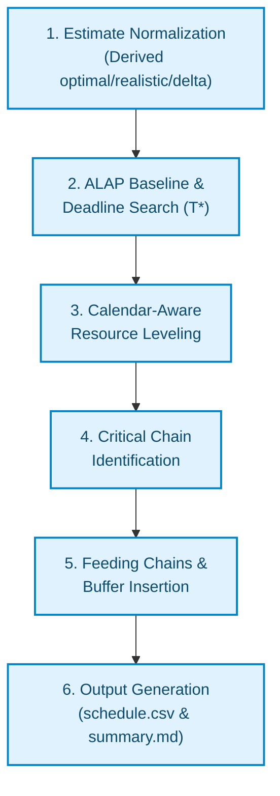
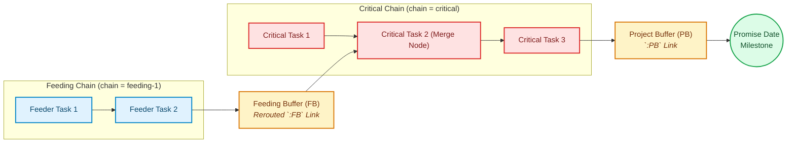

# Network Layout & Scheduling Engine Rules

This document describes the deterministic algorithm and rules used by `ccpm-scheduler` to level resources, identify the Critical Chain, place buffers, and lay out project networks into scheduled timelines.

---

## High-Level Pipeline Architecture

The scheduling engine operates in 6 sequential, deterministic steps:

---

## 1. Estimate Normalization

Before scheduling, every task is normalized into a triple `(optimal_duration, realistic_duration, delta)`:

- **Optimal Duration (`dur`)**: The padding-free, aggressive duration used for actual calendar placement.
- **Realistic Duration (`realistic`)**: The estimate including safety padding.
- **Per-Task Safety (`delta`)**: The safety removed from the task, calculated as `delta = realistic - optimal`.

If `optimal_duration` is omitted in the input network, it is derived as `ceil(realistic / 2)`.

---

## 2. Late-Start (ALAP) Baseline & Deadline Search

CCPM schedules tasks **As Late As Possible (ALAP)** to minimize work-in-progress (WIP) and defer capital expenditure.

1. **Trial Deadline (`T`)**: The engine tests project deadlines starting at the un-leveled ALAP finish date.
2. **Backward Pass**: For a given trial deadline `T`, late-start dates `S_i` and finish dates `F_i` are computed recursively from project end to entry tasks:
    - **Finish-to-Start (`FS+lag`)**: `F_A <= S_B - lag`
    - **Start-to-Start (`SS+lag`)**: `S_A <= S_B - lag`
    - **Finish-to-Finish (`FF+lag`)**: `F_A <= F_B - lag`
    - **Start-to-Finish (`SF+lag`)**: `S_A <= F_B - lag`

---

## 3. Calendar-Aware Resource Leveling

Resource leveling guarantees that total daily resource demand does not exceed resource capacity on any day `t` in `[0, T*)`.

### Resource Capacity Overrides
For each resource `r`, per-day capacity `C_r(t)` is defined by the base resource capacity modified by half-open calendar windows `[from, to)`:
- Capacity `0`: Resource unavailable (e.g., weekends, holidays, maintenance).
- Tasks execute **contiguously**: A task requiring `D` working days must find a contiguous `D`-day window where daily capacity is available.

### Shift-Earlier Leveling Algorithm

Leveling processes days backward from `T* - 1` down to `0`:

1. **Identify Over-Allocated Days**: If resource demand on day `t` exceeds `C_r(t)`, the engine identifies all overlapping tasks assigned to resource `r`.
2. **Apply Tie-Breaking Rules**: Tasks are prioritized for retention (remaining at their current schedule) based on:
    - Longest total precedence path length through task.
    - Latest scheduled finish date.
    - Task ID (alphabetical deterministic fallback).
3. **Shift Lower-Priority Tasks**: Over-allocated tasks are shifted **earlier** to the latest available contiguous window that satisfies both precedence constraints and resource capacity.
4. **Extend Deadline if Infeasible**: If no feasible leveling exists under deadline `T`, deadline `T` is incremented (`T = T + 1`), and the leveling pass retries.

---

## 4. Critical Chain Identification

Once a resource-feasible schedule is found under minimum deadline `T*`, the engine traces the **Critical Chain**:

1. **Traceback**: Starts at project deadline `T*` and moves backward to day `0`.
2. **Constraint Link Resolution**: At each step, the engine determines *why* a critical task ended at its scheduled time:
    - **Precedence Constraint**: Pushed by a predecessor task's completion.
    - **Resource Constraint**: Pushed by resource contention with another task on the same resource pool.
    - **Calendar Constraint**: Pushed by a calendar outage window.
3. **Chain Designation**: The resulting contiguous sequence of precedence links and resource links forms the **Critical Chain** (`chain = "critical"`).

---

## 5. Feeding Chains & Buffer Insertion

Tasks not on the Critical Chain belong to **Feeding Chains** (`chain = "feeding-1"`, `"feeding-2"`, etc.).

### Buffer Sizing & Attachment Rules

1. **Project Buffer (PB)**:
    - Placed at the end of the Critical Chain.
    - Sized over the Critical Chain tasks using the selected `--buffer-method` (`cap`, `hchain`, or `rsem`).
    - Protects the project promise date: `Promise Date = T* + PB`.

2. **Feeding Buffers (FB)**:
    - Placed wherever a non-critical chain merges into the Critical Chain.
    - **Link Rerouting**: The direct dependency link between feeder and critical successor is rerouted through the feeding buffer row (`<FB_id>:FB`).
    - Sized over the feeding chain tasks up to the merge point.
    - **Gap Bridging & Shortfalls**: If a feeding chain finishes earlier than the merge point, the feeding buffer absorbs the gap. If the available gap is smaller than the calculated buffer, the summary reports `N (method wanted M)` to highlight the shortfall.

    !!! warning "Unprotected Merges (Feeding Chains Without Buffers)"

        If a feeding chain cannot be shifted earlier (due to resource capacity limits or predecessor constraints), its finish date lands tight against the start of its critical successor (`gap = 0`).
        Because `ccpm-scheduler` enforces a policy to **never emit a zero-length (0-day) buffer row**, the feeding buffer is omitted entirely and flagged as an **unprotected merge**.
        In `summary.md` and CLI build stats, this path is reported with an explicit warning:
        *"Warning: the merge ... has no room for a feeding buffer — that path is effectively critical. Watch it as closely as the critical chain."*

3. **FINISH Milestone**:
    - If non-critical feeding chains run all the way to project completion without merging into a critical task, they anchor to a synthetic zero-duration `FINISH` milestone at the end of the Critical Chain before the Project Buffer.

---

## 6. Output Generation (`schedule.csv` & `summary.md`)

The final layout produces two core artifacts:

- **`schedule.csv`**: Contains every scheduled row (`task`, `project_buffer`, `feeding_buffer`), start/finish offsets, chain designations, resource assignments, and predecessor link strings.
- **`summary.md`**: Provides full human-readable audit telemetry, including total project duration `T*`, Critical Chain length, buffer sizes, merge counts, and calendar constraint statistics.
